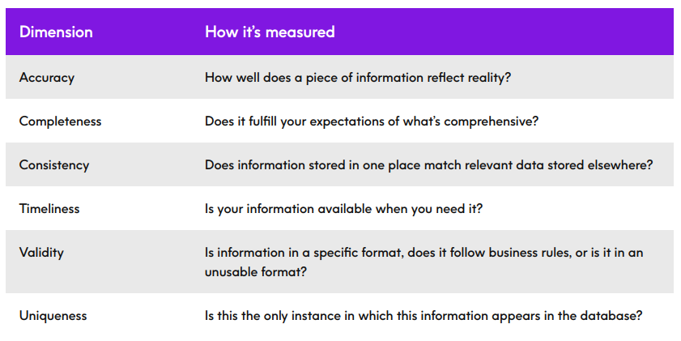

# TBD

- Translation of business goals into data mining goals

# To improve

- Project management:
	- Create a better project methodology (plan)
	- Tools (github actions)
- Tools:
	- Analytics
	- Database
	- Other tools (e.g. data cleaning, visualization)

# Data preparation

- Data integration - **convert data formats and join tables through foreign keys**
    - Create an SQL script that adds a processed view of every single table into the database
    - Create an python script that executes a query that joins the views into a single table and outputs it into a .csv file (to be further processed during the feature selection step)

- Assessment of dimensions of data quality

    
	- Accuracy:
	- Completeness:
	- Consistency:
	- Timeliness:
	- Validity:
	- Uniqueness:

- Cleaning - **analyze data with pandas and remove redundant attributes, use methods to fill missing values (if possible) and identify outliers, discuss if they make sense or not, and remove/correct them if they do not** - use of multiple python scripts:
	- Redundancy - **systematic removal of redundant attributes**
	- Missing data - **replace MVs with complex method (e.g. regression, classification) with correct experimental setup**
	- Outliers - **identify and discuss outliers, and address them with complex (technical or domain-dependent) approaches**

- Data transformation for compatibility with algorithms - **adequate complex discretization or rescaling** - one python script that handles this step

> Discretization is the process through which we can transform continuous variables, models or functions into a discrete form. We do this by creating a set of contiguous intervals (or bins) that go across the range of our desired variable/model/function.

> Feature scaling is a method used to normalize the range of independent variables or features of data.

- Feature engineering from tabular data - **complex methods (e.g. aggregation) AND knowledge (e.g. business concepts)** - create new attributes with available data (one python script), and justify the choices with data knowledge.
- (DOUBT) Sampling for domain-specific purposes - **focus on adequate subset of the population**
- (DOUBT) Sampling for development - **start with very small sample and grow to significant one**s
- Imbalanced data - **used advanced methods (e.g. SMOTE) correctly** - [Sklearn SMOTE](https://imbalanced-learn.org/stable/references/generated/imblearn.over_sampling.SMOTE.html) or other useful algorithms, use a python script to work on the loans that haven't been paid (minority class)

> One approach to addressing imbalanced datasets is to oversample the minority class. The simplest approach involves duplicating examples in the minority class, although these examples don’t add any new information to the model. Instead, new examples can be synthesized from the existing examples. This is a type of data augmentation for the minority class and is referred to as the Synthetic Minority Oversampling Technique, or SMOTE for short.

- Feature selection - **correct, combined use of filter and wrapper-based methods** - https://scikit-learn.org/stable/modules/feature_selection.html
    - Filter: remove features that seem useless and test it (Compare model metrics for data with and without the feature). These features can be found using, for example, correlation matrixes. 
    - Wrapped-based methods: automatically test filtering with multiple attributes and achieve an optimal set of attributes that achieves better results in a given metric.

Dependencies:
- data integration, data cleaning, data transformation, feature engineering, imbalanced data treatment (SMOTE), feature selection (now that the dataset is balanced previous attributes that weren't useful may be useful)